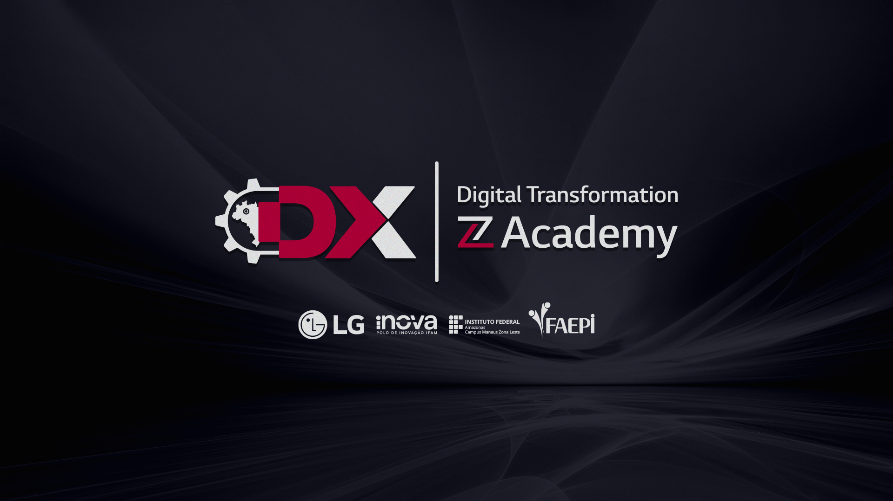
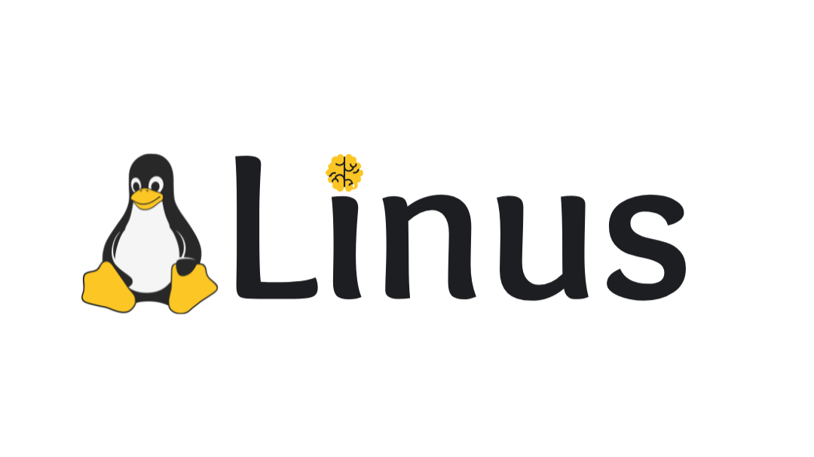

# ZL Academy

## Introdução

O projeto **ZL Academy Digital Transformation** é uma iniciativa inovadora que visa capacitar profissionais nas áreas de **Python**, **Aprendizado de Máquina**, **Inteligência Artificial** e **Hyperautomation**. A proposta é promover a transformação digital e o desenvolvimento de habilidades essenciais para o mercado de trabalho na Amazônia Ocidental, fortalecendo o capital intelectual da região.

Essa academia é organizada pelo **DX - Digital Transformation Experience**, **IFAM** (Instituto Federal de Educação, Ciência e Tecnologia do Amazonas), **FAEPI** (Fundação de Apoio ao Ensino, Pesquisa, Extensão e Interiorização do IFAM) e **LG Electronics**. 

O curso faz parte de um convênio firmado entre essas instituições para preencher lacunas entre academia e indústria, formando profissionais altamente capacitados em tecnologias emergentes. O projeto também tem um papel social, ao contribuir para a formação de talentos locais e para a inovação nos processos produtivos da indústria.

## Equipe Linus

Nosso mascote é o pinguim, em homenagem ao criador do sistema operacional Linux, Linus Torvalds, que inspira a inovação e a colaboração.

## Colaboradores

.png>)

- Ademar Castro: [LinkedIn](https://br.linkedin.com/in/ademar-castro-8bb95b256)
- Jade Santos: [LinkedIn]()
- Natália Rufino: [LinkedIn]()
- Rodrigo Souza: [LinkedIn]()

## Edital do Curso

Este projeto faz parte da **Seleção Simplificada de Pessoa Física para Curso de Formação Inicial e Continuada (FIC)**, conforme o **Edital Nº 043/2024**. O curso possui 40 vagas e tem como público-alvo estudantes e recém-formados das áreas de Engenharia e Tecnologia. O curso, com duração de 592 horas, ocorrerá de **17/06/2024 a 21/02/2025**, em duas turmas com turnos diferentes (matutino e vespertino), e tem como objetivo promover a capacitação avançada em Hyperautomation, Machine Learning e tecnologias relacionadas.

## Sobre o Repositório

Este repositório contém os materiais e códigos desenvolvidos pela Equipe Linus ao longo do curso ZL Academy. Nosso objetivo é colaborar, aprender e aplicar o conhecimento adquirido nas aulas em projetos práticos, visando contribuir para a transformação digital na região e criar soluções inovadoras.

Sinta-se à vontade para explorar, contribuir e aprender com a gente!

---

Para mais informações sobre o edital e o cronograma do curso, consulte o arquivo [EDITAL Nº 043/2024](https://drive.google.com/file/d/1QORcQrQ5fsqGE-GfEV7l8Gc3Ddm4Pzwa/view).
